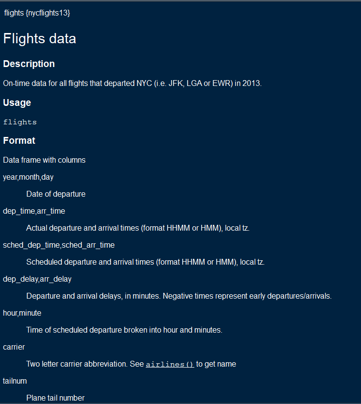
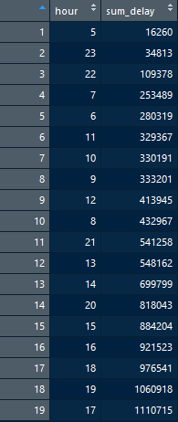

では、[Rではじめるデータサイエンス](https://www.amazon.co.jp/R%E3%81%A7%E3%81%AF%E3%81%98%E3%82%81%E3%82%8B%E3%83%87%E3%83%BC%E3%82%BF%E3%82%B5%E3%82%A4%E3%82%A8%E3%83%B3%E3%82%B9-Hadley-Wickham/dp/487311814X)における指定問題2.と3.(p.67)の解説をします。
まず、準備段階として[GitHubのIssue](https://github.com/Ylab-Shiny/lesson_190524/issues/1)述べた
`install.packages(c("tidyverse", "nycflights13"))`をRconsoleで実行し、外部パッケージをインストール
してください。

# データ(flights)の確認{-}
とりあえず、データセットの確認を行ってみましょう。
```{r}
# パッケージの読み込み
library(tidyverse)
library(nycflights13)

# RstudioのGlobal Environmentにflightsオブジェクトを作成
flights <- flights
# 上から5行までのデータの表示
head(flights)
```
`flights <- flights`というコードをRstudioのConsoleで実行することによって、RstudioのGlobal Environmentにデータの行数(obs.)と列数(variables)が表示されます。


また、`View(flights)`を同様に実行することでRstudio上で文字通りデータを下図のように眺めることができます。


データの系列（変数）の確認については、`?flights`を実行することで確認できます。



- year,month,day：文字通りの意味で出発日に関する系列(Date of departure) <br>
- dep_time,arr_time：実際の出発時刻と到着時刻の系列(Actual departure and arrival times (format HHMM or HMM), local tz.) <br>
- sched_dep_time,sched_arr_time：予定出発時刻と予定到着時刻の系列(Scheduled departure and arrival times (format HHMM or HMM), local tz.) <br>
- dep_delay,arr_delay：出発と到着の分単位の遅れの系列。負値は早い出発及び到着をあらわす(Departure and arrival delays, in minutes. Negative times represent early departures/arrivals.) <br>
- hour,minute：出発予定時刻を時間と分に分割した系列(Time of scheduled departure broken into hour and minutes.) <br>
- carrier：2文字の業者の略語の系列(Two letter carrier abbreviation. See `airlines()` to get name)
- tailnum：飛行機の末尾番号の系列(Plane tail number) <br>
- flight：フライト番号の系列(Flight number) <br>
- origin,dest：出発地と目的地の系列(Origin and destination. See `airports()` for additional metadata.) <br>
- air_time：飛行中に費やした時間（単位：分）系列(Amount of time spent in the air, in minutes) <br>
- distance：空港間の距離（単位：マイル）系列(Distance between airports, in miles) <br>
- time_hour：POSIXct型のフライト予定日時系列。出発地とともに、フライトデータを気象データに結合するために使用される(Scheduled date and hour of the flight as a POSIXct date. Along with origin, can be used to join flights data to weather data.) <br>

# 2.どの飛行機(tailnum)が定時離着陸記録に関して最悪か。{-}
それでは、本題に移りましょう。方針としては、飛行機ごとに遅れまたは予定の早まりを集計すればよいということです。定刻きっかりに進行することが望まれると考えられるため、数値は絶対値として扱うこととします。

```{r}
# tailnumのデータ数
data_tailnum <- flights %>% 
  filter(!is.na(tailnum)) %>% 
  group_by(tailnum) %>% 
  summarise(N = n()) %>% 
  arrange(desc(N))

# 飛行機の最大・最小数
max(data_tailnum$N)
min(data_tailnum$N)

# 遅れに関するデータオブジェクトdata_delay
data_delay <- flights %>% 
  filter(!is.na(dep_delay), !is.na(arr_delay)) %>% 
  group_by(tailnum) %>% 
  mutate(delay_score = abs(dep_delay) + abs(arr_delay)) %>% 
  select(tailnum, delay_score) %>% 
  summarise(score = sum(delay_score), N = n()) %>% 
  mutate(mean_score = score / N) %>% 
  arrange(desc(mean_score))

# deta_delayの確認
head(data_delay)
tail(data_delay)
```
では、コードについて解説します。`data_tailnum`では飛行機の便数に関するデータオブジェクトを作成しています。2行目の`filter`関数(p.39)で`tailnum`が欠損値である行を行まるごと除き（リストワイズ）、`tailnum`を`group_by`関数(p.63)によってグルーピングし、`summarize`関数(p.55)で飛行機名毎の総便数`N`を求めています。`N`の最大と最小を確認すると、最大は575便、最小は1便の運航となっており、飛行機によってNに大きな差があることが分かります。 

この結果を受け、1便当たりの遅れ時間`mean_score`を求め、その値が最も大きいものを最悪な飛行機と呼ぶことにしますw 

`data_delay`データオブジェクトにおいて、`mean_score`を求めることとします。まず、`filter(!is.na(dep_delay), !is.na(arr_delay))`でキャンセル便をリストワイズします。そして、続く行の`mutate`関数(p.48)で定刻との差の絶対値を足し合わせることで`delay_score`を求め、5行目で`select`関数(p.45)を用いて、必要とする系列(`tailnum`,`delay_score`)を選択しています。そして、6行目で`tailnum`毎の定刻との差の総和と総便数を求め、`mutate`で`mean_score`系列を追加し、最後に`arrange(desc)`を用いることで、`mean_score`を基準とする降順に並べ替えています。 <br>

結果的に、`data_delay`の先端部を確認することで、*N844MH*という飛行機が最悪であると分かります。1便だけですが、約10時間分の定刻との差はいただけませんね。逆に最高？な飛行機は、こちらも1便だけですが*N7BVAA*という結果となりました。

それと、定刻との差が0である飛行機名は存在しませんでした。飛行機運航は定刻通りに進むことはとても難しいようです。私も初めての飛行機旅行として、中部国際-新千歳行きの便を利用したとき、出発が2時間ほど遅れるというアクシデント遭遇した経験があります。

# 3. 遅延をできるだけ避けたいとすれば、どの時間に飛行するとよいか。{-}
次の問題に移ります。まず、私の考えでは問題文で「遅延を避けたい」とされているので、遅延スコア値（`dep_delay`と`arr_delay`）の和`delay_value`が負であるものはリストワイズしてしまえばいいと思います。なぜ和による遅延スコア値で判断するべきかというと、例えば、出発は遅れたが到着は早まって結果的に和が0以下となる（先の遅れを取り戻した）ケース（逆もまた然り）が想定されるためです。

そして、先程の問題と同様に出発予定時間`hour`でグルーピングし、集計するという方針とします。

```{r}
# dep_delayまたはarr_delayが負のものをリストワイズ
data_avoid_delay <- flights %>% 
  filter(!is.na(dep_delay), !is.na(arr_delay)) %>% 
  mutate(delay_value = dep_delay + arr_delay) %>% 
  filter(delay_value >= 0) %>% 
  group_by(hour) %>% 
  select(hour, delay_value) %>% 
  summarise(sum_delay = sum(delay_value)) %>% 
  arrange(sum_delay)

# 最適な時間
BestWorst_hours <- c(data_avoid_delay$hour[1], data_avoid_delay$hour[nrow(data_avoid_delay)])
print(paste0("遅延をできるだけ避けるには、", BestWorst_hours[1], "時発の便を選択するとよいでしょう"))
print(paste0("一方、遅延を最も避けにくいのは、", BestWorst_hours[2], "時発の便です"))
```

コードについては、先の問題と比べて真新しいものは存在しないので割愛させていただきます。

結果として、5時発の便を選ぶのがよいという結果となりました。各出発時刻ごとの結果を下に示します。パッと見た感じ、午前中に出発する便の方が遅延が少なそうに思われます。



もし内容について御質問やご指摘がありましたら、こちらの[GitHubのIssue]((https://github.com/Ylab-Shiny/lesson_190524/issues/1))で対応しようと思います。
