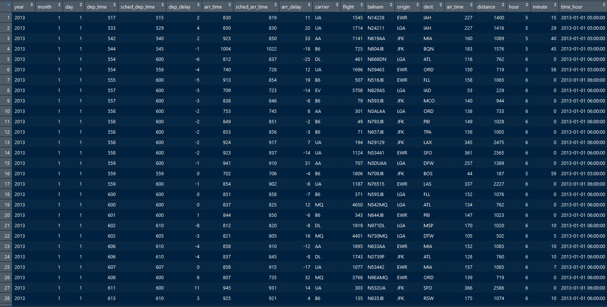

では、5月24日（金）までの指定課題(p.67)の解説をします。
まず、準備段階として[Issuesページ](https://github.com/Ylab-Shiny/lesson_190524/issues/1)述べた
`install.packages(c("tidyverse", "nycflights13"))`をRconsoleで実行し、外部パッケージをインストール
してください。

# データ(flights)の確認{-}
とりあえず、データセットの確認を行ってみましょう。
```{r}
# パッケージの読み込み
library(tidyverse)
library(nycflights13)

# RstudioのGlobal Environmentにflightsオブジェクトを作成
flights <- flights
# 上から5行までのデータの表示
head(flights)
```
`flights <- flights`というコードをRstudioのConsoleで実行することによって、RstudioのGlobal Environmentにデータの行数(obs.)と列数(variables)が表示されます。


また、`View(flights)`を同様に実行することでRstudio上で文字通りデータを下図のように眺めることができます。



データの系列（変数）の確認については、`?flights`を実行することで確認できます。


- year,month,day：文字通りの意味で出発日に関する系列(Date of departure) <br>
- dep_time,arr_time：実際の出発時刻と到着時刻の系列(Actual departure and arrival times (format HHMM or HMM), local tz.) <br>
- sched_dep_time,sched_arr_time：予定出発時刻と予定到着時刻の系列(Scheduled departure and arrival times (format HHMM or HMM), local tz.) <br>
- dep_delay,arr_delay：出発と到着の分単位の遅れの系列。負値は早い出発及び到着をあらわす(Departure and arrival delays, in minutes. Negative times represent early departures/arrivals.) <br>
- hour,minute：出発予定時刻を時間と分に分割した系列。(Time of scheduled departure broken into hour and minutes.) <br>
- carrier：2文字の業者の略語(Two letter carrier abbreviation. See `airlines()` to get name)
- tailnum：飛行機の末尾番号(Plane tail number)